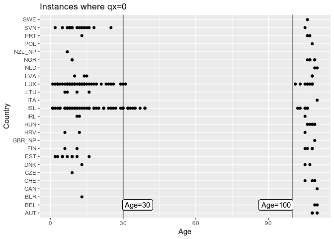

Data Sanitation Justifcation
================

``` r
# Load used libraries
library(readr)
library(tidyverse)
library(knitr)

# Read in the merged dataset for 2011
dataset = read_csv("../../data/01_processed/2011_qx_data.csv")
```

``` r
dataset %>% filter(qx == 0) %>% 
  ggplot(aes(x=Age, y=Country)) + geom_point() +
  geom_vline(xintercept = 30) +
  geom_vline(xintercept = 100) +
  geom_label(aes(x=36, y="BEL", label="Age=30")) +
  geom_label(aes(x=93, y="BEL", label="Age=100")) +
  ggtitle("Instances where qx=0")
```

<!-- -->

### Instances where qx==0 for Age groups below 60

``` r
dataset %>% filter(qx == 0) %>% 
  filter(Age < 60) %>% 
  group_by(Country) %>% 
  summarise( min(Age), max(Age),  n()  ) %>% 
  arrange(desc(`max(Age)`)) %>% 
  kable(align = 'c')
```

| Country | min(Age) | max(Age) | n() |
| :-----: | :------: | :------: | :-: |
|   ISL   |    1     |    39    | 55  |
|   LUX   |    1     |    31    | 43  |
|   SVN   |    2     |    25    | 17  |
|   EST   |    2     |    16    | 11  |
|   LTU   |    6     |    16    |  4  |
|   LVA   |    10    |    15    |  3  |
|   BLR   |    13    |    13    |  1  |
|   DNK   |    13    |    13    |  1  |
|   PRT   |    13    |    13    |  1  |
|   HRV   |    6     |    12    |  2  |
|   IRL   |    11    |    12    |  2  |
|   FIN   |    6     |    11    |  2  |
|   CZE   |    9     |    9     |  1  |
|   NOR   |    9     |    9     |  3  |
| NZL\_NP |    7     |    7     |  1  |

### Instances where qx==0 for Age groups over 60

``` r
dataset %>% filter(qx == 0) %>% 
  filter(Age >= 60) %>% 
  group_by(Country) %>% 
  summarise( min(Age), max(Age),  n()  ) %>% 
  arrange(`min(Age)`) %>%  
  kable(align = 'c')
```

| Country | min(Age) | max(Age) | n() |
| :-----: | :------: | :------: | :-: |
|   LUX   |   101    |   108    |  8  |
|   ISL   |   102    |   106    |  6  |
|   CHE   |   105    |   109    |  4  |
|   DNK   |   105    |   107    |  2  |
|   FIN   |   105    |   108    |  4  |
|   HRV   |   105    |   105    |  1  |
|   IRL   |   105    |   105    |  1  |
|   SVN   |   105    |   105    |  1  |
|   HUN   |   106    |   109    |  6  |
|   NOR   |   106    |   109    |  5  |
|   PRT   |   106    |   107    |  2  |
|   SWE   |   106    |   106    |  1  |
|   AUT   |   108    |   110    |  4  |
|   LVA   |   108    |   108    |  2  |
|   POL   |   108    |   108    |  1  |
|   BEL   |   109    |   110    |  2  |
| GBR\_NP |   109    |   109    |  1  |
|   NLD   |   109    |   110    |  2  |
|   CAN   |   110    |   110    |  1  |
|   ITA   |   110    |   110    |  1  |
