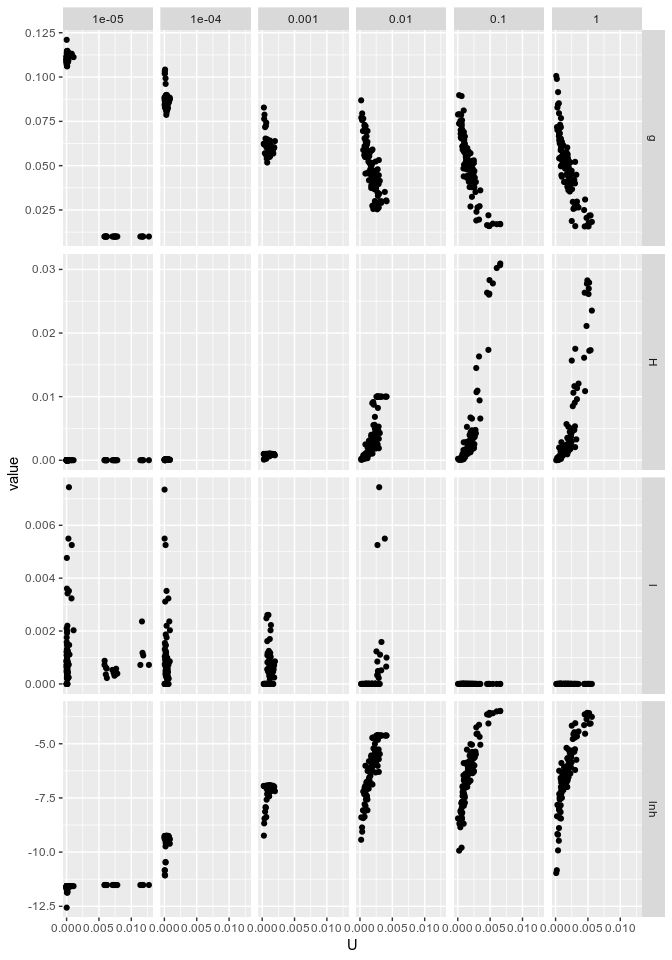
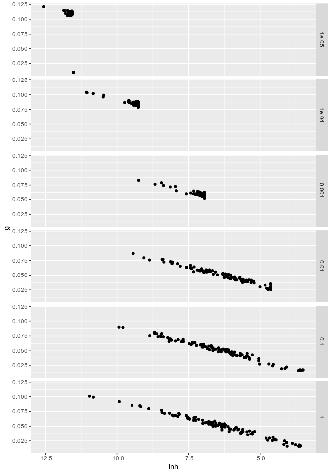
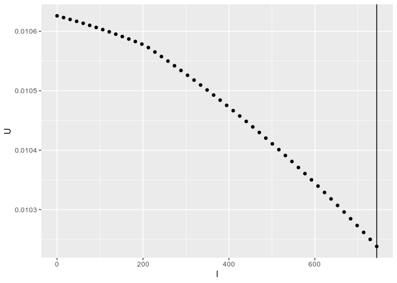
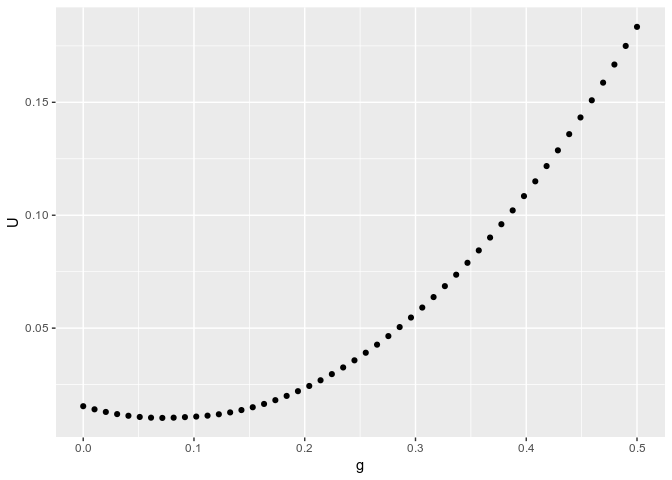
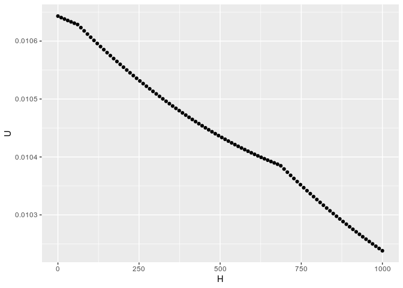

Optimization Issues
================

# Introduction

I managed to use the “L-BFGS-B” algorithmn (Byrd et. al. (1995)), which
is implemented in base-R `optim` function. The algorithmn utilizes the
gradient of the function and some box-constraint to optimize the
function to a minimum. However, I found that the optimization is relient
on the constraint provided. Additionally, I found it a bit hard to trust
the result given the ouput of the stage-2 model (\(lnh = Lg-x^{*}\)).
The optimization relies on the boundaries for \(H\) to be well-defined,
as larger upper-boundaries of \(H\) causes \(\lambda_m \rightarrow 0\).

In order to run further analysis, I decided to learn the function
emperically and found that the best fit appears to occur when
\(\min_x \tilde{q_x} \approx \lambda\).

# Optimization

## 1\. Target Functions

First I had to define the target functions as curried-functions
(functions that return functions).

``` r
# Target Functions
U = function(qtx, Age) function(par) {
  # extract parameters
  l = par[1]; H = par[2]; g = par[3];
  # evaluate function
  sum( ( qtx - l - H*exp(g*Age) )^2 ) / (max(Age) - min(Age))
}
dU = function(qtx, Age) function(par) {
  # extract parameters
  l = par[1]; H = par[2]; g = par[3];
  n = max(Age) - min(Age)
  # describe the "middile-part of the summation"
  inner = qtx - l - H*exp(g*Age)
  # compute each derivative
  dUdl = sum( inner*(-2)/n )
  dUdH = sum( inner*(-2)*exp(g*Age) / n )
  dUdg = sum( inner*(-2)*H*Age*g*exp(g*Age) / n )
  # return
  c(dUdl, dUdH, dUdg)
}
```

## 2\. Optimization

Next I define the method that we will use.

``` r
fit_model = function(qtx, Age) optim( 
  method = 'L-BFGS-B',
  # initial guess
  par=c( 1E-5, 1E-5, 1E-2 ), 
  # target functions
  fn=U(qtx, Age), gr=dU(qtx, Age),
  # boundaries
  lower = c(0, 0, 0), upper = c(min(qtx), 1E-4, 1)
)
```

## 3\. Run Optimzation

``` r
dataset %>%
  filter(between(Age, 35, 95)) %>% 
  mutate( qtx = -log( 1-qx ) ) %>% 
  group_by(Gender, Country) %>% nest %>% mutate(
    # compute the model for each country/gender group
    model = map(data, ~fit_model(.$qtx, .$Age)$par ),
    # extract parameters
    l_m = map_dbl(model, ~.[1]),
    H = map_dbl(model, ~.[2]),
    g = map_dbl(model, ~.[3]),
    h = g*H/(exp(g)-1),
    lnh = log(h),
    m = (log(g) - lnh)/g,
    b = 1/g,
    U = map2_dbl(data, model, ~U(.x$qtx, .x$Age)(.y))
  ) -> Stage1_model
```

### Table1a: Fit on Males

| Country Name | l\_m\*10^5 | H\*10^5 | g      |     lnh |      m |      b |
| :----------- | ---------: | ------: | :----- | ------: | -----: | -----: |
| Australia    |    101.634 |  10.000 | 8.467% | \-9.253 | 80.124 | 11.811 |
| Austria      |     64.370 |   8.678 | 8.679% | \-9.396 | 80.095 | 11.522 |
| Belarus      |    525.277 |  10.000 | 8.792% | \-9.255 | 77.608 | 11.374 |
| Belgium      |     85.537 |  10.000 | 8.710% | \-9.254 | 78.229 | 11.481 |
| Canada       |      0.000 |   7.142 | 8.757% | \-9.591 | 81.711 | 11.419 |
| Croatia      |    110.930 |   9.899 | 8.709% | \-9.264 | 78.354 | 11.483 |
| Czechia      |     50.743 |  10.000 | 8.746% | \-9.254 | 77.950 | 11.433 |
| Denmark      |     98.348 |   7.158 | 8.981% | \-9.590 | 79.947 | 11.135 |
| Estonia      |    202.906 |   9.089 | 8.700% | \-9.350 | 79.403 | 11.495 |
| Finland      |    107.414 |   8.611 | 8.749% | \-9.404 | 79.643 | 11.430 |
| France       |     75.023 |   8.967 | 8.536% | \-9.362 | 80.853 | 11.715 |
| Germany      |     70.150 |   9.754 | 8.606% | \-9.279 | 79.317 | 11.620 |
| Greece       |     92.749 |   9.650 | 8.475% | \-9.289 | 80.480 | 11.800 |
| Hungary      |    123.116 |   9.933 | 8.774% | \-9.261 | 77.821 | 11.398 |
| Ireland      |     66.647 |   9.616 | 8.528% | \-9.292 | 80.094 | 11.726 |
| Israel       |     43.162 |   9.770 | 8.298% | \-9.275 | 81.780 | 12.051 |
| Italy        |     56.777 |   9.441 | 8.578% | \-9.311 | 79.916 | 11.658 |
| Japan        |     63.759 |   9.595 | 8.450% | \-9.294 | 80.744 | 11.834 |
| Korea        |    107.758 |   7.259 | 8.902% | \-9.575 | 80.397 | 11.234 |
| Latvia       |    323.523 |   9.033 | 8.830% | \-9.356 | 78.480 | 11.326 |
| Lithuania    |    351.818 |  10.000 | 8.688% | \-9.254 | 78.391 | 11.510 |
| Luxembourg   |      0.000 |   5.638 | 9.270% | \-9.830 | 80.386 | 10.788 |
| Netherlands  |     53.915 |   7.071 | 8.764% | \-9.601 | 81.770 | 11.410 |
| New Zealand  |      0.000 |   9.498 | 8.557% | \-9.305 | 80.009 | 11.686 |
| Norway       |     66.982 |   8.844 | 8.727% | \-9.377 | 79.508 | 11.459 |
| Poland       |      0.000 |   9.684 | 8.656% | \-9.286 | 79.007 | 11.552 |
| Portugal     |    117.569 |  10.000 | 8.580% | \-9.254 | 79.225 | 11.654 |
| Russia       |    734.892 |   9.511 | 8.804% | \-9.305 | 78.090 | 11.359 |
| Slovakia     |    147.273 |   9.792 | 8.724% | \-9.275 | 78.363 | 11.463 |
| Slovenia     |     85.844 |   9.572 | 8.796% | \-9.298 | 78.077 | 11.369 |
| Spain        |     57.030 |   9.783 | 8.478% | \-9.275 | 80.291 | 11.795 |
| Sweden       |     66.422 |   7.121 | 8.784% | \-9.594 | 81.536 | 11.385 |
| Switzerland  |     60.380 |   8.335 | 8.700% | \-9.436 | 80.397 | 11.495 |
| Taiwan       |      0.000 |   8.590 | 8.467% | \-9.405 | 81.914 | 11.810 |
| U.K.         |     81.894 |   8.649 | 8.614% | \-9.399 | 80.652 | 11.610 |
| U.S.A.       |    115.488 |   9.514 | 8.487% | \-9.303 | 80.554 | 11.783 |
| Ukraine      |    549.604 |   9.940 | 8.858% | \-9.261 | 77.188 | 11.290 |

### Table1b: Fit on Females

| Country Name | l\_m\*10^5 | H\*10^5 | g       |      lnh |      m |      b |
| :----------- | ---------: | ------: | :------ | -------: | -----: | -----: |
| Australia    |     48.912 |   9.987 | 8.164%  |  \-9.253 | 82.650 | 12.250 |
| Austria      |     28.825 |   8.316 | 8.478%  |  \-9.437 | 82.212 | 11.796 |
| Belarus      |    125.547 |   9.048 | 8.674%  |  \-9.354 | 79.651 | 11.528 |
| Belgium      |     48.696 |  10.000 | 8.293%  |  \-9.252 | 81.546 | 12.059 |
| Canada       |     35.460 |   8.318 | 8.218%  |  \-9.436 | 84.412 | 12.168 |
| Croatia      |      0.000 |   9.381 | 8.659%  |  \-9.318 | 79.352 | 11.548 |
| Czechia      |     46.498 |   9.476 | 8.580%  |  \-9.307 | 79.854 | 11.655 |
| Denmark      |      0.000 |   9.863 | 8.257%  |  \-9.266 | 82.014 | 12.111 |
| Estonia      |      0.000 |   9.859 | 8.399%  |  \-9.267 | 80.841 | 11.906 |
| Finland      |     31.335 |   8.849 | 8.410%  |  \-9.375 | 82.036 | 11.891 |
| France       |     48.512 |   9.982 | 8.008%  |  \-9.252 | 84.010 | 12.487 |
| Germany      |     30.830 |   8.273 | 8.506%  |  \-9.443 | 82.041 | 11.756 |
| Greece       |     40.545 |   9.677 | 8.297%  |  \-9.285 | 81.908 | 12.053 |
| Hungary      |     63.020 |  10.000 | 8.607%  |  \-9.254 | 79.021 | 11.619 |
| Ireland      |     24.331 |   9.531 | 8.249%  |  \-9.300 | 82.488 | 12.122 |
| Israel       |     43.101 |   9.642 | 8.235%  |  \-9.288 | 82.467 | 12.143 |
| Italy        |     33.891 |   9.402 | 8.207%  |  \-9.313 | 83.018 | 12.185 |
| Japan        |     55.315 |   9.997 | 7.866%  |  \-9.250 | 85.273 | 12.713 |
| Korea        |     55.581 |   9.248 | 8.260%  |  \-9.330 | 82.765 | 12.107 |
| Latvia       |     71.926 |  10.000 | 8.632%  |  \-9.254 | 78.826 | 11.585 |
| Lithuania    |     83.879 |   9.490 | 8.510%  |  \-9.306 | 80.397 | 11.751 |
| Luxembourg   |     20.933 |   8.079 | 8.584%  |  \-9.467 | 81.683 | 11.650 |
| Netherlands  |      0.000 |   9.999 | 8.260%  |  \-9.252 | 81.819 | 12.106 |
| New Zealand  |     50.485 |   8.648 | 8.452%  |  \-9.398 | 81.964 | 11.832 |
| Norway       |      0.000 |   9.999 | 8.265%  |  \-9.252 | 81.775 | 12.099 |
| Poland       |     44.461 |   9.851 | 8.399%  |  \-9.268 | 80.852 | 11.906 |
| Portugal     |     38.223 |   9.253 | 8.300%  |  \-9.330 | 82.424 | 12.049 |
| Russia       |      0.000 |   4.349 | 9.542%  | \-10.091 | 81.130 | 10.480 |
| Slovakia     |     48.204 |   9.607 | 8.635%  |  \-9.294 | 79.263 | 11.580 |
| Slovenia     |     18.621 |   7.959 | 8.551%  |  \-9.482 | 82.123 | 11.694 |
| Spain        |     23.348 |   9.563 | 8.144%  |  \-9.296 | 83.355 | 12.279 |
| Sweden       |      0.000 |   0.678 | 11.267% | \-11.959 | 86.764 |  8.875 |
| Switzerland  |     18.049 |   9.279 | 8.250%  |  \-9.327 | 82.811 | 12.122 |
| Taiwan       |     46.631 |   8.981 | 8.293%  |  \-9.360 | 82.840 | 12.059 |
| U.K.         |     51.087 |   9.036 | 8.248%  |  \-9.353 | 83.147 | 12.124 |
| U.S.A.       |      0.000 |   3.590 | 9.287%  | \-10.282 | 85.121 | 10.768 |
| Ukraine      |    175.754 |   9.893 | 8.811%  |  \-9.266 | 77.586 | 11.349 |

## 4\. Concerns

The above estimation used a number of constraints that I acquired
emperically by looking at the linear regression fit where
\(\lambda_m = 0\). The constraints for \(\lambda_m\) are based on the
original results of the paper you’ve sent me.

\[
  0 \le \lambda_m \le \min{\tilde{q_x}} \\
  0 \le H \le 5*10^{-4} \\
  0 \le g \le 1
\]

A slight tweak to the constraints (say increasing the upper-boundary of
\(H\) by a factor of \(10\) result in drastically different results).

In the figure below, I have utilized different values for the
upper-boundary of \(H\), ranging from \(10^{-5}\) to 1. Observe how the
value of \(g\) and \(H\) become more relevant for higher upper
boundaries of \(H\) while \(\lambda_m\) approach zero.

<!-- -->

Please note that in addition to that, the values of \(\lnh\) appear to
have a much smaller variance for smaller boundaries of \(H\), we
effectively have a trade-off between \(\lambda_m\) and the accuracy of
\(\lnh\). In the figure below I show-case how the boundaries impact the
variance of \(\lnh\) and the relationship between \(g\) and \(\lnh\).

<!-- -->

# Emperical Approximation

In this approach (which is much more resource intensive), I attempt to
find the best minima using a grid-search for the parameters. In essence,
this approach is a brute-force approach to identify the parameters.

Below is the methodology

``` r
grid_search <- function(qtx, Age) {
  u = U(qtx, Age);  du = dU(qtx, Age);
  # generate the grid
  lapply(
    seq(0,0.5,l=50), function(g) lapply(
      seq(0,1E-2,l=100), function(H) lapply(
        seq(0,min(qtx),l=50), function(l) tibble(
          # Compute values
          g=g,l=l,H=H, 
          U=u(c(g,H,l)),
          dU=du(c(g,H,l))
        )
      ) %>% reduce(bind_rows)
    ) %>% reduce(bind_rows)
  ) %>% reduce(bind_rows) %>% 
  # Compute the rest of the values and format l and H
  mutate(
    l = l*1E5, H = H*1E5,
    h = g*H/(exp(g)-1),
    lnh = log(h),
    m = (log(g) - lnh)/g,
    b = 1/g
  )
}
```

Nest I compute the result for Russian, Ukrainian and Canadian males.

``` r
data_russ_male = emp_dataset$RUS_Male[[1]]
data_ukr_male = emp_dataset$UKR_Male[[1]]
data_can_male = emp_dataset$CAN_Male[[1]]

emp_rus = with(data_russ_male, { grid_search(qtx, Age) })
emp_ukr = with(data_ukr_male, { grid_search(qtx, Age) })
emp_can = with(data_can_male, { grid_search(qtx, Age) })
```

Then I output the parameters for the lowest values of \(\Upsilon\). Note
that the values of \(\lambda_m\) are always equal to the minima of
\(\tilde{q_x}\).

``` r
emp_rus %>% filter( U == min(U) ) %>% distinct(g,l,H) %>% 
  mutate( `min(qx)` = min(data_russ_male$qtx)*10^5 ) %>% kable()
```

|         g |        l |    H |  min(qx) |
| --------: | -------: | ---: | -------: |
| 0.0714286 | 743.9605 | 1000 | 743.9605 |

``` r
emp_ukr %>% filter( U == min(U) ) %>% distinct(g,l,H) %>%
  mutate( `min(qx)` = min(data_ukr_male$qtx)*10^5 ) %>% kable()
```

|         g |        l |    H |  min(qx) |
| --------: | -------: | ---: | -------: |
| 0.0816327 | 549.6076 | 1000 | 549.6076 |

``` r
emp_can %>% filter( U == min(U) ) %>% distinct(g,l,H) %>%
  mutate( `min(qx)` = min(data_can_male$qtx)*10^5 ) %>% kable()
```

|         g |        l |    H |  min(qx) |
| --------: | -------: | ---: | -------: |
| 0.0408163 | 87.83857 | 1000 | 87.83857 |

Finally, I also looked at the relationship between the variables and the
lowest \(\Upsilon\) they generated.

``` r
emp_rus %>% 
  group_by(l) %>% summarise(U = min(U)) %>% 
  ggplot() + geom_point(aes(l, U)) +
  geom_vline(xintercept=min(data_russ_male$qtx)*10^5)
```

<!-- -->
Please note that the straight-line represents the minium of
\(\tilde{q_x}\).

``` r
emp_rus %>% 
  group_by(g) %>% summarise(U = min(U)) %>% 
  ggplot() + geom_point(aes(g, U))
```

<!-- -->

``` r
emp_rus %>% 
  group_by(H) %>% summarise(U = min(U)) %>% 
  ggplot() + geom_point(aes(H, U))
```

<!-- -->

# Conclusion

First, please be aware that I have attempted a number of other
approaches as well. Among these,

  - Using the residual values of the zero-makeham model as an estimate
    for \(\lambda_m\).
  - Scalling \(lamnda_m\) by a factor of \(10^5\) and running it against
    Newton-method with unconstraint parameters

These methods consistently over-estimated or under-estimated the
variables.

We may need to generate the values here using an analytical approach.
However, in the meantime, please consider the previous approach where we
manually tried various models with varying lambda’s and then picked the
best one in accordance to the model’s fit. As mentioned in a previous
email, the values of lambda appeared large during our skype call due to
the display function multiplying the result by 10^6 instead of
10^5.

<https://github.com/asosnovsky/Mortality-Adj-Bio-Age-Around-the-world/blob/master/data/02_paper_tables/table_1_Male.csv>
