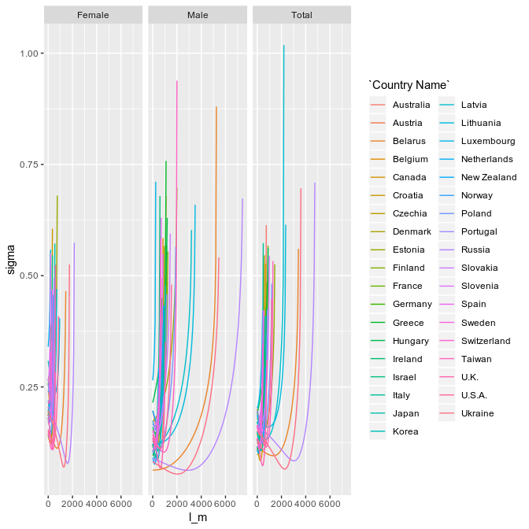

Optimizing Makeham
================

``` r
# Load used libraries
library(readr)
library(tidyverse)
library(knitr)
source("../../scripts/00_method.R")
```

``` r
# Read in the merged dataset for 2011
dataset = read_csv("../../data/01_processed/2011_qx_data.csv") %>% 
  filter(between(Age, 35, 95)) %>% 
  # Remove Iceland as its too much of an outlier
  filter(
    !(Country %in% c("ISL"))
  )
# Read in the optimized makeham data
Stage1_model <- read_rds("../../data/02_models/stage1.rds")
Stage2_model <- read_rds("../../data/02_models/stage2.rds")
```

``` r
# Compute zero-makeham for comparison
stage1_zero_make = dataset %>% mutate(lambda_makeham = 0) %>% compute_stage1 
stage2_zero_make = stage1_zero_make %>% compute_stage2 
```

``` r
Stage1_model %>% select(`Country Name`, Gender, model) %>% unnest(model) %>% 
  ggplot(aes(y=sigma, x=l_m, color=`Country Name`)) + 
  facet_grid(cols = vars(Gender)) +
  geom_line()
```

<!-- -->
